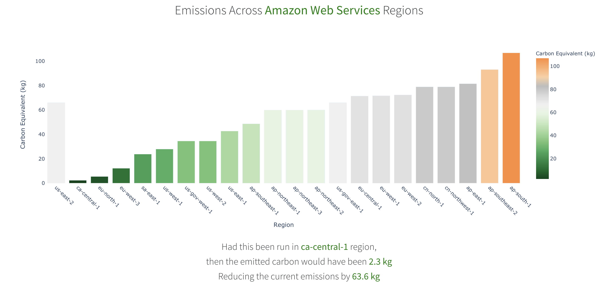
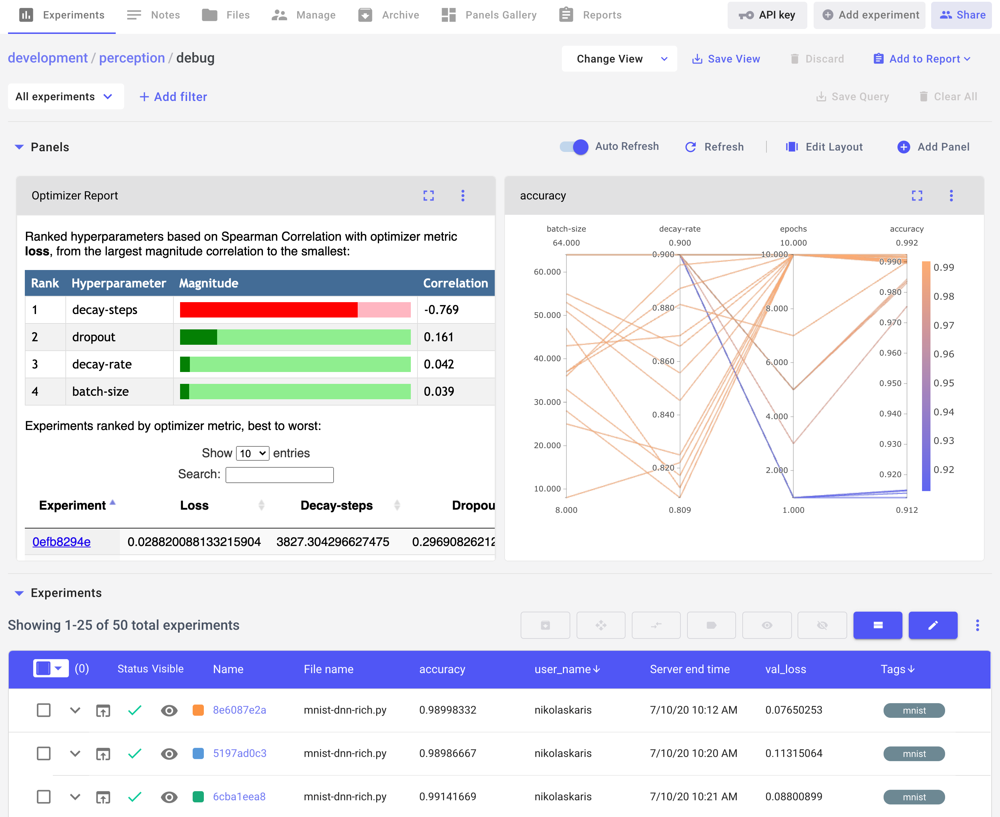

<br/>

Track the carbon emissions of your machine learning code, quantify your impact (and log it all on [comet.ml](https://comet.ml)!)

<br/>

[](https://anaconda.org/codecarbon/codecarbon)
[](https://pypi.org/project/codecarbon/)

- [About CodeCarbon](#about-codecarbon)
- [Installation](#installation)
  - [pip](#pip)
  - [conda](#conda)
  - [latest](#latest)
- [Quickstart](#quickstart)
    - [Online mode](#online-mode)
    - [Offline mode](#offline-mode)
    - [Using comet.ml](#using-cometml)
- [Examples](#examples)
- [Contributing](#contributing)
- [Built-in Visualization Tool](#built-in-visualization-tool)
- [Comet Integration](#comet-integration)
- [Generate Documentation](#generate-documentation)

# About CodeCarbon

While computing currently represents roughly 0.5% of the world’s energy consumption, that percentage is projected to grow beyond 2% in the coming years, which will entail a significant rise in global CO2 emissions if not done properly. Given this increase, it is important to quantify and track the extent and origin of this energy usage, and to minimize the emissions incurred as much as possible.

For this purpose, we created **CodeCarbon**, a Python package for tracking the carbon emissions produced by various kinds of computer programs, from straightforward algorithms to deep neural networks.

By taking into account your computing infrastructure, location, usage and running time, CodeCarbon can provide an estimate of how much CO<sub>2</sub> you produced, and give you some comparisons with common modes of transporation to give you an order of magnitude.

Our hope is that this package will be used widely for estimating the carbon footprint of computing, and for establishing best practices with regards to the disclosure and reduction of this footprint.

Follow the steps below to set up the package and don't hesitate to open an issue if you need help!


# Installation
Create a virtual environment using `conda` for easier management of dependencies and packages.
For installing conda, follow the instructions on the [official conda website](https://docs.conda.io/projects/conda/en/latest/user-guide/install/)

```
conda create --name codecarbon python=3.6
conda activate codecarbon
```

## pip

```
pip install codecarbon
```

## conda

```
conda install -c codecarbon -c conda-forge codecarbon
```

## latest

```
git clone git@github.com:mlco2/codecarbon.git
cd codecarbon
pip install .
```

`codecarbon` will now be installed in your the local environment

# Quickstart

### Online mode
This is the most straightforward usage of the package, which is possible if you have access to the Internet, which is necessary to gather information regarding your geographical location.

```python
from codecarbon import EmissionsTracker
tracker = EmissionsTracker()
tracker.start()
# GPU Intensive code goes here
tracker.stop()
```
You can also use the decorator:

```python
from codecarbon import track_emissions

@track_emissions
def training_loop():
   pass
```

### Offline mode

This mode can be used in setups without internet access, but requires a manual specification of your country code.
A complete list of country ISO codes can be found on [Wikipedia](https://en.wikipedia.org/wiki/List_of_ISO_3166_country_codes).

The offline tracker can be used as follows:
```python
from codecarbon import OfflineEmissionsTracker

tracker = OfflineEmissionsTracker(country_iso_code="CAN")
tracker.start()
# GPU Intensive code goes here
tracker.stop()
```

or by using the decorator:

```python
from codecarbon import track_emissions

@track_emissions(offline=True, country_iso_code="CAN")
def training_loop():
   pass
```

### Using comet.ml

Nothing to do here 🚀 ! Comet automatically logs your emissions if you have CodeCarbon installed. More about comet and adding the CodeCarbon panel to your project in [Comet Integration](#comet-integration).

# Examples

As an illustration of how to use CodeCarbon, we created a simple example using TensorFlow for digit classification on the [MNIST dataset](http://yann.lecun.com/exdb/mnist/):

First, install Tensorflow  2.0:

```
pip install tensorflow
```

Then, run the examples in the [`examples/`](/examples/) folder, which will call the online version of the Emissions tracker by default:

```
python examples/mnist.py
python examples/mnist_decorator.py
```

This will create a `.csv` file with information about the energy that you used to carry out the classification task, and an estimate of the CO<sub>2</sub> that you generated, complete with comparisons to common modes of transportation to give you a better idea of the order of magnitude of your emissions.

# Contributing

We are hoping that the open-source community will help us edit our code and make it better!
If you want to contribute, make sure that the [`tox` package](https://tox.readthedocs.io/en/latest/example/package.html) is available to run tests and debug:

```
pip install tox
```

You can run tests by simply entering tox in the terminal when in the root package directory, and it will run the predefined tests.

```
tox
```
In order to contribute a change to our code base, please submit a pull request (PR) via GitHub and someone from our team will go over it and accept it.

# Built-in Visualization Tool
To track the evolution of your CO<sub>2</sub> emissions or just to see some nice graphs and charts, you can use the visualization tool that we created.
As input, it takes a .csv file in the format generated by the Emissions Tracker, and it generates a visualization of the emissions incurred.

You can run try it out on a sample data file such as the one in `examples/emissions.csv`, and run it with the following command from the code base:
```
python codecarbon/viz/carbonboard.py --filepath="examples/emissions.csv"
```

If you have the package installed, you can run the CLI command:

```
carbonboard --filepath="examples/emissions.csv" --port=xxxx
```


Once you have generated your own .csv file based on your computations, you can feed that into the visualization tool to see a more visual representation of your own emissions.


You can also see the carbon intensity of different regions and countries:


As well as the relative carbon intensity of different compute regions of cloud providers:



# Comet Integration

**CodeCarbon** automatically integrates with [Comet](https://www.comet.ml/site) for experiment tracking and visualization. Comet provides data scientists with powerful tools to track, compare, explain and reproduce their experiments, and now with **CodeCarbon** you can easily track the carbon footprint of your jobs along with your training metrics, hyperparameters, dataset samples, artifacts and more.



To get started with the **Comet**-**CodeCarbon** integration, make sure you have `comet-ml` installed:

```
pip install comet_ml>=3.2.2
```

The minimum Comet version

Go to [Comet's website](https://www.comet.ml/signup) and create a free account. From your account settings page, copy your personal API key.

In the [`comet-mnist.py`](examples/comet-mnist.py) example file, replace the placeholder code with your API key:

```
exp = Experiment(api_key="YOUR API KEY")
```

Run your experiment and click on the link in stdout to be taken back to the Comet UI. Automatically you'll see your metrics, hyperparameters, graph definition, system and environment details and more.

**Comet** will automatically create an `EmissionsTracker` from the `codecarbon` package. To visualize the carbon footprint of your experiment, go to the `Panels` tab in the left sidebar and click `Add Panel`.

From the Panel Gallery click the `Public` tab and search for `Emissions Tracker`. Once you've found it, add it to your Experiment.


Now back in the `Panels` tab you'll see your Emissions Tracker visualization in the Comet UI. To render the Emissions Tracker visualization by default, save your `View`. And voilà! Every time you run your experiments, you'll be able to visualize your CodeCarbon emissions data alongside everything else you need to track for your research.


# Generate Documentation
No software is complete without great documentation!
To make generating documentation easier, install the [`sphinx` package](https://www.sphinx-doc.org/en/master/usage/installation.html#installation-from-pypi) and use it to edit and improve the existing documentation:
```
pip install -U sphinx sphinx_rtd_theme
cd docs/edit
make docs
```
In order to make changes, edit the `.rst` files that are in the `/docs/edit` folder, and then run:
```
make docs
```
to regenerate the html files.
