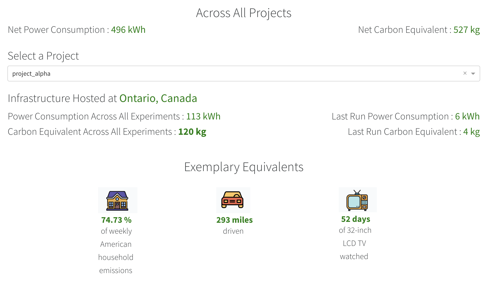
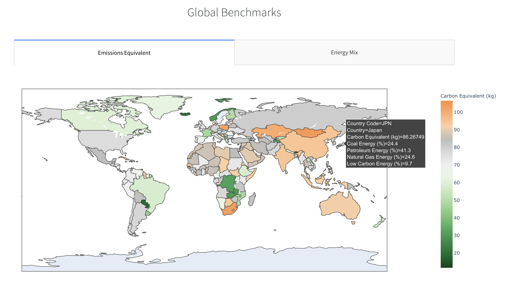
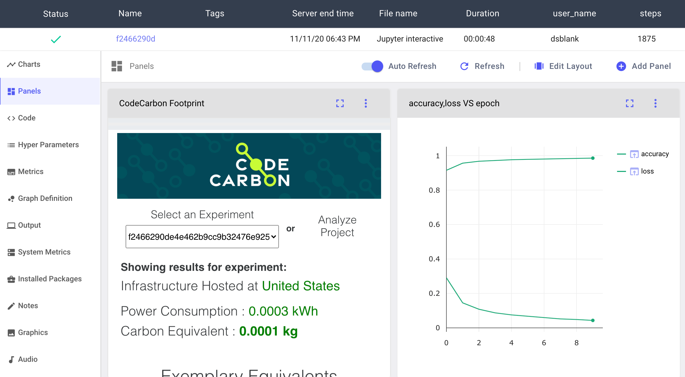

Estimate and Track carbon emissions from the compute, quantify and analyze their impact.

[Official Documentation](https://mlco2.github.io/codecarbon)

[](https://anaconda.org/codecarbon/codecarbon)
[](https://pypi.org/project/codecarbon/)


# About CodeCarbon

While computing currently represents roughly 0.5% of the world’s energy consumption, that percentage is projected to grow beyond 2% in the coming years, which will entail a significant rise in global CO2 emissions if not done properly. Given this increase, it is important to quantify and track the extent and origin of this energy usage, and to minimize the emissions incurred as much as possible.

For this purpose, we created **CodeCarbon**, a Python package for tracking the carbon emissions produced by various kinds of computer programs, from straightforward algorithms to deep neural networks.

By taking into account your computing infrastructure, location, usage and running time, CodeCarbon can provide an estimate of how much CO<sub>2</sub> you produced, and give you some comparisons with common modes of transportation to give you an order of magnitude.

Our hope is that this package will be used widely for estimating the carbon footprint of computing, and for establishing best practices with regards to the disclosure and reduction of this footprint.

Follow the steps below to set up the package and don't hesitate to open an issue if you need help!


# Installation
Create a virtual environment using `conda` for easier management of dependencies and packages.
For installing conda, follow the instructions on the [official conda website](https://docs.conda.io/projects/conda/en/latest/user-guide/install/)

```
conda create --name codecarbon python=3.6
conda activate codecarbon
```

### Install from PyPI repository

```
pip install codecarbon
```

### Install from Conda repository

```
conda install -c codecarbon -c conda-forge codecarbon
```

`codecarbon` is now installed in your the local environment


# Infrastructure Support
Currently the package supports following hardware infrastructure.

### GPU
- Tracks Nvidia GPUs power consumption using `pynvml` library, (which is installed with the package install).

### CPU

#### On Windows and Mac
- Tracks Intel processors power consumption using the `Intel Power Gadget`
- You need to **[install it independently](https://software.intel.com/content/www/us/en/develop/articles/intel-power-gadget.html)** for CodeCarbon to function.

*Note:* Please ensure that the Intel Power Gadget has the [required security permissions](https://osxdaily.com/2019/03/03/install-intel-power-gadget-mac/) on MacOS.


#### On Linux
- Tracks Intel Processors power consumption from Intel RAPL files at `/sys/class/powercap/intel-rapl` ([reference](http://web.eece.maine.edu/~vweaver/projects/rapl/))
- All CPUs listed in this :point_up: directory will be tracked. [Help us improve this and make it configurable.](https://github.com/mlco2/codecarbon/issues/156)

*Note:* The Power Consumption will be tracked only if the RAPL files exist at the above mentioned path.

#### On all platforms

If CodeCarbon cannot find the appropriate software to track the CPUs' energy consumption, it will use a fallback strategy:

* If it can match you cpu type to a [list of know CPUs](https://github.com/mlco2/codecarbon/blob/master/codecarbon/data/hardware/cpu_power.csv) it will use 50% of the CPU model's TDP as constant consumption
* If it really can't tell anything about your CPU it will use a constant consumption of 85W

# Quickstart

### Online mode
This is the most straightforward usage of the package, which is possible if you have access to the Internet, which is necessary to gather information regarding your geographical location.

```python
from codecarbon import EmissionsTracker
tracker = EmissionsTracker()
tracker.start()
# GPU Intensive code goes here
tracker.stop()
```
You can also use the decorator:

```python
from codecarbon import track_emissions

@track_emissions
def training_loop():
   pass
```

### Offline mode

This mode can be used in setups without internet access, but requires a manual specification of your country code.
A complete list of country ISO codes can be found on [Wikipedia](https://en.wikipedia.org/wiki/List_of_ISO_3166_country_codes).

The offline tracker can be used as follows:
```python
from codecarbon import OfflineEmissionsTracker

tracker = OfflineEmissionsTracker(country_iso_code="CAN")
tracker.start()
# GPU Intensive code goes here
tracker.stop()
```

or by using the decorator:

```python
from codecarbon import track_emissions

@track_emissions(offline=True, country_iso_code="CAN")
def training_loop():
   pass
```

### Using comet.ml

Nothing to do here 🚀 ! Comet automatically logs your emissions if you have CodeCarbon installed. More about comet and adding the CodeCarbon panel to your project in [Comet Integration](#comet-integration).

### Configuration

CodeCarbon is developed with flexibility in mind. This means you don't have to keep passing the same arguments over and over to `EmissionTracker` objects in your scripts. **Any and all arguments can be set from configuration files**. CodeCarbon will look sequentially for arguments in:

- `~/.codecarbon.config` (global user config)
- `./.codecarbon.config` (local directory config)
- `CODECARBON_ARG` (environment variables)
- `EmissionsTracker(arg=value)`

Config files are INI text files which should look like:

```ini
[codecarbon]
arg=value
```

More details in the [documentation](https://mlco2.github.io/codecarbon).

# Examples

As an illustration of how to use CodeCarbon, we created a simple example using TensorFlow for digit classification on the [MNIST dataset](http://yann.lecun.com/exdb/mnist/):

First, install Tensorflow  2.0:

```
pip install tensorflow
```

Then, run the examples in the [`examples/`](/examples/) folder, which will call the online version of the Emissions tracker by default:

```
python examples/mnist.py
python examples/mnist_decorator.py
```

This will create a `.csv` file with information about the energy that you used to carry out the classification task, and an estimate of the CO<sub>2</sub> that you generated, complete with comparisons to common modes of transportation to give you a better idea of the order of magnitude of your emissions.


# Data Sources

To find the carbon efficiency of your cloud region, you can look into [CodeCarbon's cloud data](https://github.com/mlco2/codecarbon/tree/master/codecarbon/data/cloud).
If you are using a private infrastructure you can look into the [CodeCarbon's private infrastructure](https://github.com/mlco2/codecarbon/tree/master/codecarbon/data/private_infra/2016).
[A number of resources](https://github.com/mlco2/impact/tree/master/data#mlco2s-data) can help you find the carbon efficiency of you local grid if you cannot find it in the previous links.


# Contributing

We are hoping that the open-source community will help us edit our code and make it better!

You are welcome to open issues, even suggest solutions and better still contribute the fix/improvement! We can guide you if you're not sure where to start but want to help us out 🥇


In order to contribute a change to our code base, please submit a pull request (PR) via GitHub and someone from our team will go over it and accept it.

Check out our [contribution guidelines :arrow_upper_right:](https://github.com/mlco2/codecarbon/blob/master/CONTRIBUTING.md)


# Built-in Visualization Tool
To track the evolution of your CO<sub>2</sub> emissions or just to see some nice graphs and charts, you can use the visualization tool that we created.
As input, it takes a .csv file in the format generated by the Emissions Tracker, and it generates a visualization of the emissions incurred.

You can run try it out on a sample data file such as the one in `examples/emissions.csv`, and run it with the following command from the code base:
```
python codecarbon/viz/carbonboard.py --filepath="examples/emissions.csv"
```

If you have the package installed, you can run the CLI command:

```
carbonboard --filepath="examples/emissions.csv" --port=xxxx
```


Once you have generated your own .csv file based on your computations, you can feed that into the visualization tool to see a more visual representation of your own emissions.



You can also see the carbon intensity of different regions and countries:



As well as the relative carbon intensity of different compute regions of cloud providers:


# Build Documentation
No software is complete without great documentation!
To make generating documentation easier, install the [`sphinx` package](https://www.sphinx-doc.org/en/master/usage/installation.html#installation-from-pypi) and use it to edit and improve the existing documentation:
```
pip install -U sphinx sphinx_rtd_theme
cd docs/edit
make docs
```
In order to make changes, edit the `.rst` files that are in the `/docs/edit` folder, and then run:
```
make docs
```
to regenerate the html files.


# Comet Integration

**CodeCarbon** automatically integrates with [Comet](https://www.comet.ml/site) for experiment tracking and visualization. Comet provides data scientists with powerful tools to track, compare, explain and reproduce their experiments, and now with **CodeCarbon** you can easily track the carbon footprint of your jobs along with your training metrics, hyperparameters, dataset samples, artifacts and more.


To get started with the **Comet**-**CodeCarbon** integration, make sure you have `comet-ml` installed:

```
pip install comet_ml>=3.2.2
```

The minimum Comet version

Go to [Comet's website](https://www.comet.ml/signup) and create a free account. From your account settings page, copy your personal API key.

In the [`mnist-comet.py`](examples/mnist-comet.py) example file, replace the placeholder code with your API key:

```
experiment = Experiment(api_key="YOUR API KEY")
```

Run your experiment and click on the link in stdout to be taken back to the Comet UI. Automatically you'll see your metrics, hyperparameters, graph definition, system and environment details and more.

**Comet** will automatically create an `EmissionsTracker` object from the `codecarbon` package when your code runs. To visualize the carbon footprint of your experiment, go to the `Panels` tab in the left sidebar and click `Add Panel`.

From the Panel Gallery click the `Public` tab and search for `CodeCarbon Footprint`. Once you've found it, add it to your Experiment.


Now back in the `Panels` tab you'll see your CodeCarbon Footprint visualization in the Comet UI. To render the visualization by default, save your `View`. And voilà! Every time you run your experiments, you'll be able to visualize your CodeCarbon emissions data alongside everything else you need to track for your research.




# Report your emissions: LateX template

We believe that an important step towards reducing carbon emissions is the generalization of emissions reporting in papers, blog posts and publications in general. Here's an example LateX snippet you might want to use:

```latex
\usepackage{hyperref}

\subsection{CO2 Emission Related to Experiments}

Experiments were conducted using {cloud provider} in {region}, which has a carbon efficiency of {carbon efficiency} kgCO$_2$eq/kWh. A cumulative of {hours used} hours of computation was performed on hardware of type {hardware type} (TDP of W).

Total emissions are estimated to be {emission} kgCO$_2$eq of which {percentage offset} percents were directly offset by the cloud provider.

%Uncomment if you bought additional offsets:
%XX kg CO2eq were manually offset through \href{link}{Offset Provider}.

Estimations were conducted using the \href{https://github.com/mlco2/codecarbon}{CodeCarbon emissions tracker}, a joint effort from authors of \cite{lacoste2019quantifying} and \cite{lottick2019nergy}.

@article{lacoste2019quantifying,
  title={Quantifying the Carbon Emissions of Machine Learning},
  author={Lacoste, Alexandre and Luccioni, Alexandra and Schmidt, Victor and Dandres, Thomas},
  journal={Workshop on Tackling Climate Change with Machine Learning at NeurIPS 2019},
  year={2019}
}

@article{lottick2019nergy,
    title={Energy Usage Reports: Environmental awareness as part of algorithmic
  accountability},
    author={Kadan Lottick and Silvia Susai and Sorelle A. Friedler and Jonathan P. Wilson},
    year={2019},
    journal={Workshop on Tackling Climate Change with Machine Learning at NeurIPS 2019}
}
```

### Citing CodeCarbon

```
@misc{codecarbon,
  author={Victor Schmidt and Kamal Goyal and Aditya Joshi and Boris Feld and Liam Conell and Nikolas Laskaris and Doug Blank and Jonathan Wilson and Sorelle Friedler and Sasha Luccioni},
  title={{CodeCarbon, Estimate and Track Carbon Emissions from Machine Learning Computing}},
  month={March},
  year={2021},
  note={Version 1.1.1},
  howpublished={\url{https://github.com/mlco2/codecarbon}},
}
```
